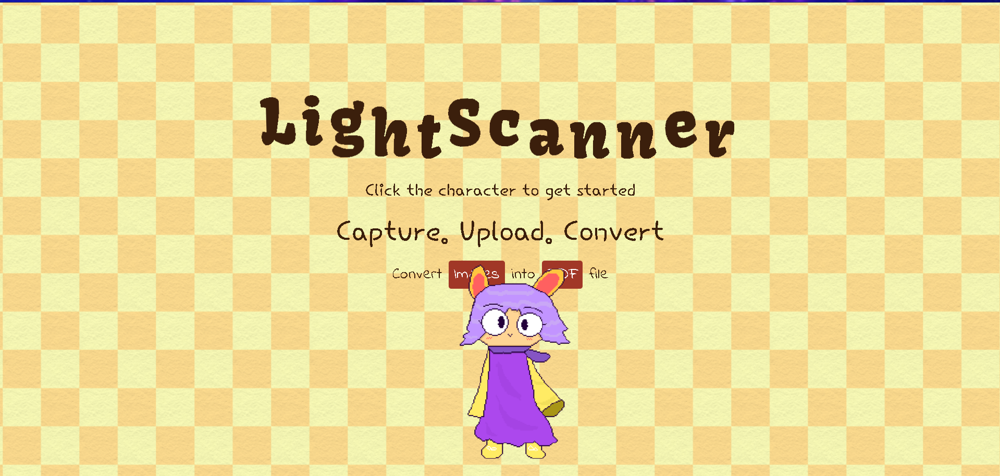
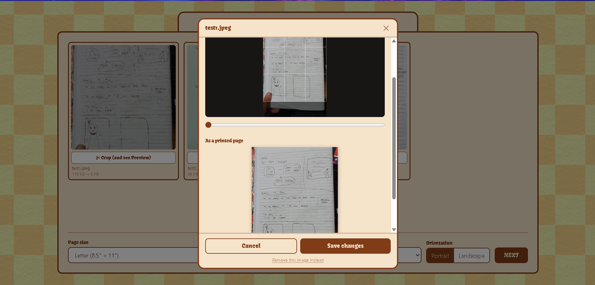

<div align="center">

# LIGHTSCANNER!

Upload your image and get your PDF!

https://lightscanner.vercel.app/

(*Don't forget to visit Backend repo too! https://github.com/nabeellagi/backend-lightscanner*)

</div>




----

## Why Lightscanner?

The idea is to create a simpler and lighter alternative for apps like Camscanner. You can easily upload your images, apply a filter, and convert them to a PDF file by accessing a website without filling up your storage with new apps. 
Additionally for desktop, Lightscanner offers the features you would see in mobile scanner apps. With Lightscanner, you're still able to convert your images into scanned-like PDFs with your laptop or PC.
The app also works if you want to simply convert images to normal PDF without filters, similar to ILovePDF.

----

## Features

1. You'll be able to upload 25 images per batch.
2. Built-in filter options: Normal, Black and White, Grayscale, Enhance, and Vivid
3. Customizable paper sizes (including custom size and fit-to-page option) and orientation
4. Crop and preview for each image.
5. For mobile, photos can be directly taken from the camera.

## How to Run Locally?

1. Clone the repository:
   ```bash
   git clone https://github.com/nabeellagi/client-lightscanner.git
   ```
2. Move into the project directory:
   ```bash
   cd client-lightscanner
   ```
3. Install the dependencies:
   ```bash
   npm i
   ```
4. Run the development server:
   ```bash
   npm run dev
   ```
5. Open [http://localhost:3000](http://localhost:3000) in your browser to see the app running.


**YOU ALSO NEED TO VISIT THE REPO FOR THE BACKEND AND CLONE IT BASED ON THE INSTRUCTIONS GIVEN THERE:** https://github.com/nabeellagi/backend-lightscanner